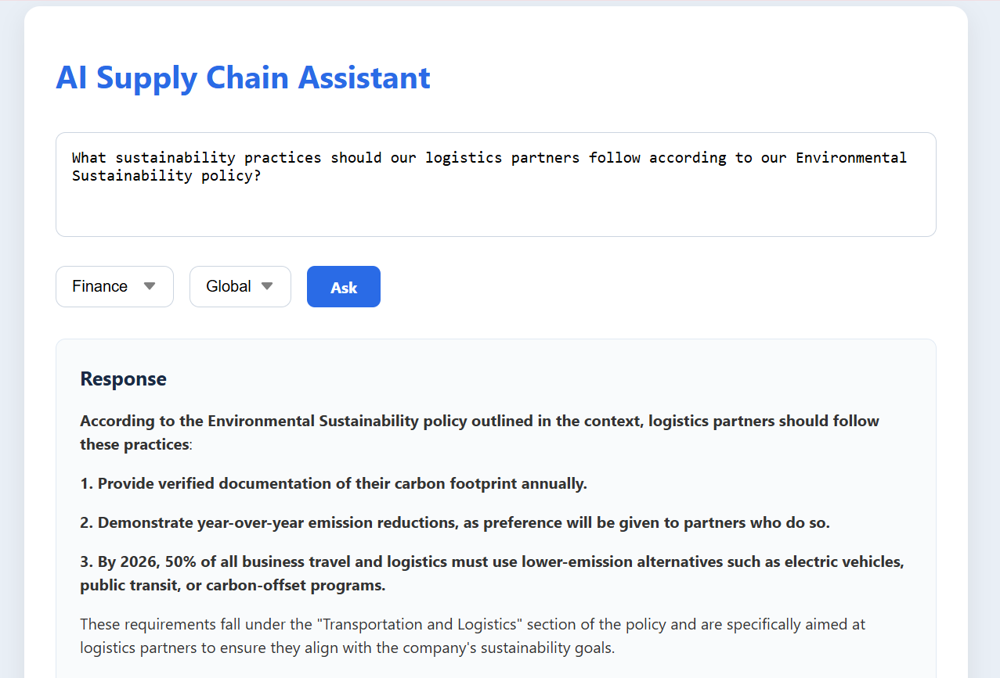
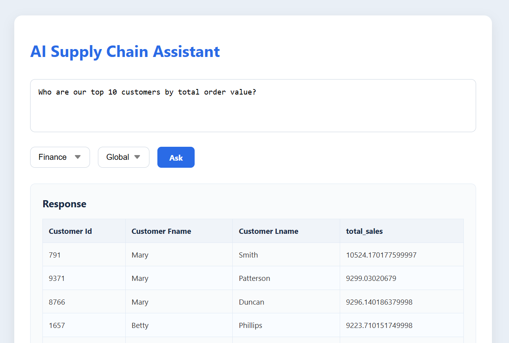

# AI Supply Chain Assistant

An AI-powered assistant for querying supply chain data and company policies.
It combines document embeddings, SQL database queries, role-based and geographic access control, and large language model (LLM) responses to provide intelligent and secure answers to user questions via a React frontend and FastAPI backend.

## Features

- **Hybrid Query Handling**: Combines vector search over company policy PDFs with SQL database queries for supply chain data.

- **Vector Store with FAISS**: Extracts text from PDFs, splits them into chunks, generates embeddings using a custom embedding model, and stores in a FAISS index.

- **Role-Based Access Control (RBAC) & Geographic Restrictions**: Enforces permissions on queries based on user roles (Finance, Planner, Manager) and regions (India, Global).

- **Large Language Model (LLM) Integration**: Uses an external LLM API to generate answers from policy document contexts.

- **FastAPI Backend**: Exposes a /query/ endpoint that accepts user queries along with role and region info.

- **React Frontend**: User-friendly interface for inputting questions, selecting role and region, and displaying rich responses including markdown and tables.

## Tech Stack

- **Backend**: Python, FastAPI, LangChain, FAISS, SQLAlchemy, SQLite

- **Frontend**: React, Axios, React Markdown

- **Embedding & LLM**: Custom API-based embeddings and text generation

- **PDF Parsing**: PyMuPDF (fitz)

## Sample Questions to ask

- What is the total sales amount for all orders?
- What is our company's definition of slow-moving inventory according to the Inventory Management policy?
- What are the required steps for handling obsolete inventory write-offs?
- What sustainability practices should our logistics partners follow according to our Environmental Sustainability policy?
- What criteria do we use to qualify new suppliers based on our Supplier Selection policy?
- How does our Returns and Reverse Logistics policy handle customer claims for damaged products?
- What are the key performance indicators for measuring supplier performance as defined in our Performance Measurement policy?
- What cyber security measures must be implemented to protect supply chain data according to our Data Security policy?
- Who are our top 10 customers by total order value?
- What is the distribution of orders by customer segment and region?
- Are there any suppliers who don't meet our minimum ethical sourcing requirements as defined in our Supplier Code of Conduct, and what percentage of our total spend do they represent?
- Based on our Product Quality Assurance standards, which products had the highest number of quality-related returns in the past year?
- According to our Transportation and Logistics policy, are we using the optimal shipping modes for high-value orders to international destinations?
- Which products that are classified as "hazardous materials" according to our HSE policy are currently being stored in facilities not certified for such materials?
- Based on our Risk Management framework, which supply chain disruptions occurred in the past year that exceeded our defined risk tolerance thresholds, and what was their financial impact?
- Which inventory items qualify as "no-movers" according to our policy, and what is their total current value?
- Which products have the highest profit margin across all categories?
- Which shipping mode has the lowest rate of on-time deliveries?
- Which product categories have shown declining sales over the past three quarters?
- What was the total sales amount for the Southeast region?
- What is the average time between order date and shipping date by country?

---

